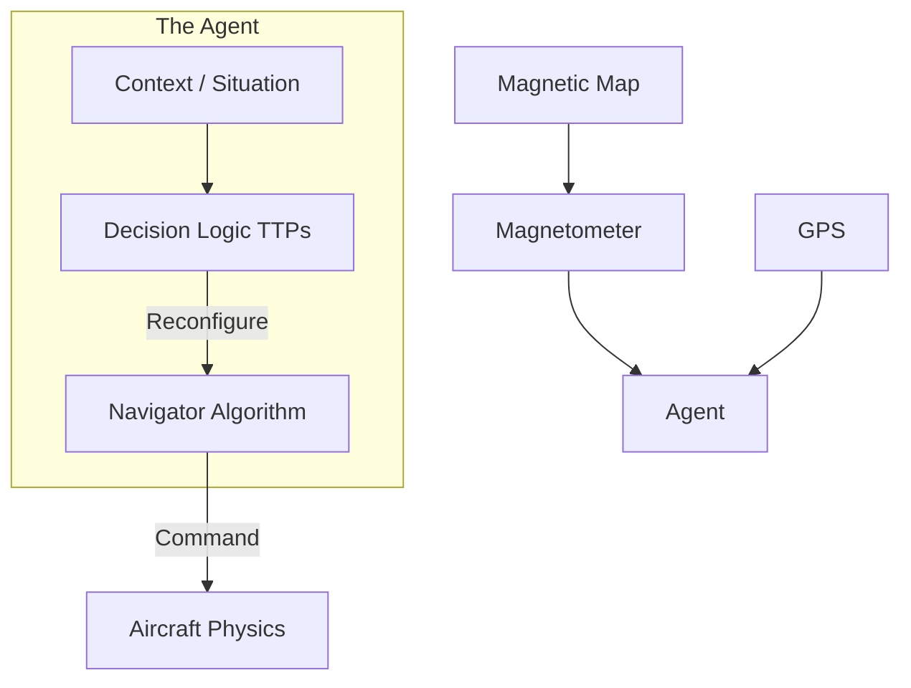

# Phase 1 Report: Foundation of Autonomous Magnetic Navigation Agents

## 1. Executive Summary
The `antigravity` project has successfully completed **Phase 1: Foundation Construction**. We have established a high-fidelity modular simulation environment capable of generating synthetic magnetic anomaly maps, simulating aircraft physics, and testing autonomous navigation logic.

Crucially, we have moved beyond simple control loops to a **Context-Aware Agent Architecture**, allowing the platform to "reason" about its sensor health and operational context to make tactical decisions (e.g., switching navigation modes under jamming).

## 2. Current Status & Achievements

### 2.1 Simulation Environment (`src/world`, `src/vehicle`)
- **Magnetic Map Generation**: Implemented fractal noise generation to create realistic, "ground truth" magnetic anomaly maps.
- **Aircraft Physics**: A 6-DOF-lite kinematic model (`Aircraft`) simulating position, heading, altitude, and speed.
- **Sensors**: A configurable `Magnetometer` sensor model that samples the ground truth map with adjustable noise signatures.

### 2.2 Navigation Logic (`src/navigation`)
- **Architecture**: Created an abstract `Navigator` base class to allow hot-swapping of algorithms.
- **Waypoint Navigation**: Implemented `WaypointNavigator` for 3D path following.
    - **Loop & Loiter**: Added robust logic to continuously fly patterns or automatically enter a holding loiter at the end of a mission to prevent loss of vehicle.

### 2.3 Agent Logic (`src/agent`)
- **Cognitive Architecture**: Implemented a "Context-Aware" Agent wrapper (`core.py`, `context.py`).
- **Data Structures**:
    - `MissionContext`: Objectives and Constraints.
    - `SituationContext`: Dynamic state and sensor health.
    - `PlatformContext`: Capabilities and System Status.
- **Decision Loop**: The Agent currently runs a **Monitor -> Estimate -> Decide -> Act** cycle.
- **Verified Behavior**: Demonstrated the Agent automatically detecting "high GPS variance" (simulated jamming) and dynamically switching its navigation source to `MAG_NAV`.

### 2.4 Verification
- **Unit Tests**: Full coverage for navigation logic.
- **Simulation**: Three distinct simulation scripts (`run_sim.py`, `run_nav_sim.py`, `run_agent_sim.py`) verify the physics, navigation, and decision-making layers respectively.

## 3. Technical Architecture
The system is designed with modularity as a first principle:

## 4. Roadmap: The Path to Cognitive Autonomy

Having established the simulation and the basic "Rule-Based" agent, the next phases focus on increasing the cognitive capabilities of the system.

### Phase 2: Role Decomposition (The "Crew")
- **Concept**: Split the monolithic Agent into specialized roles (Navigator, Operator, Commander).
- **Goal**: Simulate a multi-crew environment where specialized sub-agents negotiate for control.

### Phase 3: Neuro-Symbolic Hybrid (LLM Integration)
- **Concept**: Integrate Large Language Models (LLMs) into the "Slow Loop" of the decision architecture.
- **Goal**: Use LLMs for high-level strategic reasoning (e.g., "The mission is compromised, what should we do?") while retaining fast Python code for flight control.

### Phase 4: Collaborative Multi-Agent Systems (MAS)
- **Concept**: Expand to multi-platform swarms.
- **Goal**: Enable distributed problem solving (e.g., one drone mapping a field for another to navigate).

## 5. Conclusion
Phase 1 is complete. The infrastructure is robust, the agent logic is functional and extensible, and the path toward advanced LLM-based autonomy is clearly defined.
